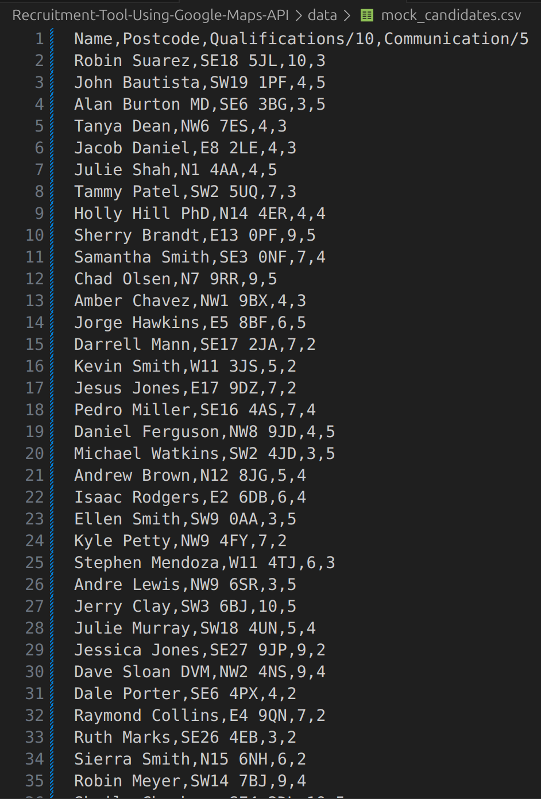
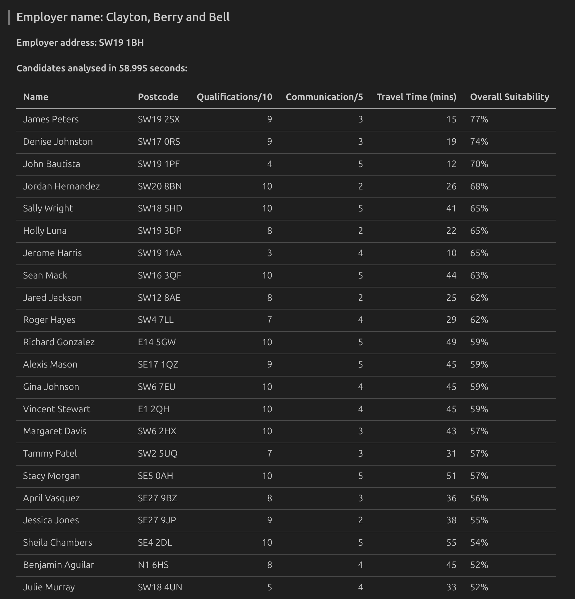

# Recruitment Tool Using Google Maps API

## Contents
1. [Overview](#overview)
   - [Creating Mock Data](#creating-mock-data)
   - [Matching Candidates with Employers](#matching-candidates-with-employers)
2. [How to Use](#how-to-use)
   - [Set Up Dependencies](#set-up-dependencies)
   - [Match the Mock Candidates](#match-the-mock-candidates)
   - [Customise Candidate Matching](#customise-candidate-matching)


## Overview

The Google Maps API allows developers to integrate Google Maps features into software applications. Companies like Uber, Lyft, Amazon, and FedEx make millions of API calls daily to optimise routes and travel times.

A lot of advanced commercial recruitment software also use Google Maps API to find accurate travel times between employers and candidates. This is particularly important with a large candidate pool in a city like London, where public transport travel times can vary significantly depending on available routes. However, I used to use less optimised software and spend time manually punching in postcodes on Google Maps and noting the travel time on paper or a spreadsheet.

This repo aims to demonstrate how even a small recruitment operation could benefit from using Google Maps API, and how manual work I used to do regularly could have been automated for free. Google Cloud Platform allows $200 worth of free services every month, which is equivalent to 40,000 API calls.

The 'find_suitable_candidates' function in `src/main.py` takes any employer details and CSV of job candidates and finds the public transport travel time between them. Where applicable, it aggregates travel time data with other metrics to create an 'overall suitability' percentage for the job. 100% would be the [perfect candidate](https://www.linkedin.com/in/tom-bracey-256337252/), with anyone over 50% probably worth contacting.

### Creating Mock Data

In order to develop the find_suitable_candidates function, I started by using the `src/create_mock_data` directory to create employer and candidate data.

First, I created the 'get_london_postcodes' function which scrapes [ukpostcode.co.uk/random-london-postcode.htm](https://www.ukpostcode.co.uk/random-london-postcode.htm).

Random values were assigned to 'Qualifications/10' and 'Communication/5', as metrics which could be used in the algorithm.

The `faker` package was used to generate realistic names for candidates and employers.

This allowed me to create names and addresses for employers, and familiar-looking raw candidate CSVs like this:



### Matching Candidates with Employers

In `src/main.py`, the find_suitable_candidates function makes an API request to Google for each candidate to find how long it would take them to get to work, assuming they leave at 8:00am. In rare cases where Google Maps can't find a postcode (happened once in development), the row will be removed and the postcode logged. The API response is reformatted to an integer of the number of minutes, so it can be used for analysis.

An 'Overall Suitability' column is created to aggregate the candidate's qualifications, communication and proximity. The formula used is:
```
df['Overall Suitability'] = ((df['Qualifications/10'] + df['Communication/5'] + (60 - df['Travel Time (mins)']) / 4) / 30 * 100)
```
The resulting data at `data/final_table.md` looks like this, with the most suitable candidates at the top:



---
## How to Use

### Set Up Dependencies

1. **Create a virtual environment**:
    ```
    python -m venv venv
    ```
2. **Activate the virtual environment**

    Linux/Mac:
    ```
    source venv/bin/activate
    ```

    Windows:
    ```
    venv\\Scripts\\activate
    ```
3. **Install the dependencies**
    ```
    pip install -r requirements.txt
    ```

### Create a New Set of Mock Candidates
```
python src/create_mock_data/create_data.py
```

Running this file will generate a table of 100 new candidates, which can be viewed in `data/mock_candidates.csv` and used to test the find_suitable_candidates function.

### Match the Mock Candidates

1. If you don't already have a Google Cloud Platform account, set one up to obtain an API key.
2. Export your API key as an environment variable:
    ```
    echo "API_KEY=<yourapikey>" > .env
    ```

3. Run the main Python file, which will export its results to `data/final_table.md`
    ```
    python src/main.py
    ```

### Customise Candidate Matching

**The function can take any employer and any candidate list CSV**

The find_suitable_candidates function is invoked on line 59 of `src/main.py`. By default, it uses the mock candidate and employer data but it's flexible. If you have a CSV file with 'Name' and 'Postcode' as columns, it can be added to the repo, and its relative path as an argument to the function. A tuple of any employer name and postcode can also be added as an argument.

For bespoke recruitment needs, you could change the invocation to something like:
```
find_suitable_candidates(employer = ('My Company Ltd.', 'SW1A 2AA'), candidates_csv = 'data/my_pool.csv')
```

**The overall suitability algorithm can easily be changed**

The algorithm to create the overall suitability column is on lines 45-46 of `src/main.py`. The metrics involved and their weighting can easily be changed on these lines.

If there are no columns matching the algorithm, like a CSV with just names and postcodes, the final table will omit the overall suitability column and instead sort rows by travel time in ascending order.
